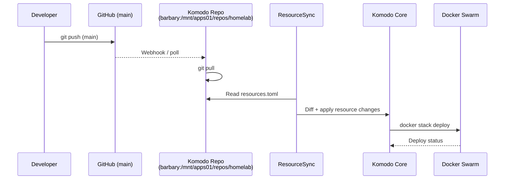
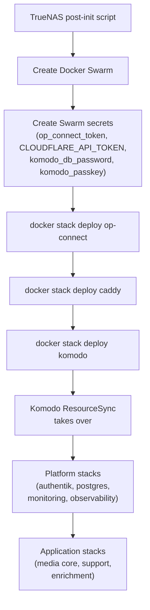
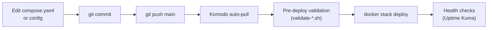

# Orchestration & Deployment

## Komodo ResourceSync

Komodo manages all platform and application tier stacks. Configuration is declarative in `komodo/resources.toml`, which defines servers, the Swarm, repos, and stacks.



The ResourceSync `homelab-resources` is self-referencing — it manages its own TOML file. Changes to `komodo/resources.toml` are applied on the next sync cycle.

### Stack Configuration

Each stack in `resources.toml` specifies:
- `swarm = "homelab-swarm"` — deploys via `docker stack deploy` (most stacks)
- `server = "barbary-periphery"` — deploys via `docker compose up -d` (Swarm-incompatible stacks)
- `linked_repo = "homelab-repo"` — source repo for compose files
- `run_directory` — path within repo to the compose file
- `auto_pull = true` — automatically pull on repo changes
- `pre_deploy.command` — validation script to run before deploy

## Bootstrap Sequence

The very first deployment (or recovery from scratch) follows a strict order because each tier depends on the previous one.



**Infrastructure tier** (steps C-F) is deployed manually via `docker stack deploy` because Komodo itself isn't running yet. Once Komodo starts, ResourceSync deploys everything else.

## Stack Deployment Workflow

Day-to-day changes follow the GitOps workflow:



1. Edit stack configuration locally
2. Commit and push to `main`
3. Komodo detects the change (webhook or poll)
4. Pre-deploy validation scripts run (if configured)
5. Stack is deployed via `docker stack deploy`
6. AutoKuma + Uptime Kuma verify service health

## Pre-Deploy Validation

Several stacks have validation scripts that run before deployment:

| Stack | Script | Checks |
|-------|--------|--------|
| `platform_monitoring` | `validate-monitoring-setup.sh` | Prometheus config, Grafana provisioning |
| `platform_authentik` | `validate-authentik-setup.sh` | Authentik config, database connectivity |
| `application_media_core` | `validate-media-setup.sh` | Media paths, NFS mounts, permissions |
| `application_media_support` | `validate-media-setup.sh` | Same media validation (shared script) |
| `infrastructure_pxe` | `validate-pxe-setup.sh` | PXE assets, TFTP paths |

Scripts live in `scripts/` and are referenced by absolute path in `resources.toml` pre-deploy hooks.

## Tier Dependency Order

Stacks must be deployed in tier order. Within a tier, stacks can deploy in any order.

```
Infrastructure (manual deploy):
  1. op-connect       — secrets available
  2. caddy            — ingress available
  3. komodo           — deployment automation available

Platform (Komodo-managed):
  4. postgres          — shared database available
  5. authentik         — SSO available
  6. monitoring        — metrics/logs available
  7. observability     — dashboard/uptime available

Application (Komodo-managed):
  8. media core        — Plex, Jellyfin, *arr stack
  9. media support     — Bazarr, Tautulli, etc.
  10. media enrichment — Kometa, posters
```

## Compose vs Swarm Mode

Most stacks deploy in Swarm mode (`docker stack deploy`), but some services are Swarm-incompatible and use Compose mode via Komodo's Periphery agent:

| Stack | Mode | Reason |
|-------|------|--------|
| `dnsmasq-proxypxe` | Compose | `network_mode: host` required for DHCP proxy |
| `smartctl-exporter` | Compose | `--privileged` required for disk access |
| All others | Swarm | Standard overlay networking |

## Related Documentation

- [Overview](overview.md) — tier model, technology stack
- [Networking](networking.md) — overlay networks created during deployment
- [Secrets](secrets.md) — init jobs that run before services start
- [Runbooks](../runbooks/stacks-deployment.md) — operational deployment procedures
