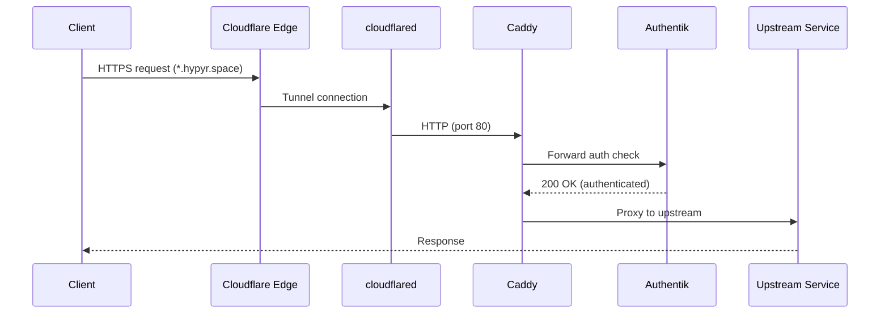

# Network Architecture

## Overlay Network Map

All inter-service communication uses Docker Swarm overlay networks. Each stack defines its own internal network and connects to shared external networks as needed.

```mermaid
flowchart TB
    subgraph external["External Networks (shared)"]
        proxy["proxy_network<br/><i>Ingress routing</i>"]
        opnet["op-connect<br/><i>Secret injection</i>"]
        pgnet["postgres<br/><i>Shared database</i>"]
    end

    subgraph internal["Internal Networks (stack-scoped)"]
        auth["authentik"]
        mon["monitoring"]
        obs["observability_internal"]
        media["media"]
        media_s["media_support"]
        media_e["media_enrichment"]
    end

    caddy["Caddy"] --- proxy
    homepage["Homepage"] --- proxy
    homepage --- obs

    authentik_srv["Authentik"] --- auth
    authentik_srv --- proxy

    prometheus["Prometheus"] --- mon
    grafana["Grafana"] --- mon
    grafana --- proxy
    grafana --- pgnet

    plex["Plex"] --- media
    plex --- proxy
    sonarr["Sonarr"] --- media
    sonarr --- proxy
    sonarr --- pgnet

    bazarr["Bazarr"] --- media_s
    bazarr --- proxy

    kometa["Kometa"] --- media_e

    op_api["op-connect-api"] --- opnet
    postgresql["PostgreSQL"] --- pgnet
```



### Network Inventory

| Network | Type | Stacks Connected | Purpose |
|---------|------|-----------------|---------|
| `proxy_network` | external overlay | All stacks with ingress | Caddy reverse proxy routing |
| `op-connect` | external overlay | Infrastructure, Platform, Media Core | 1Password Connect secret access |
| `postgres` | external overlay | PostgreSQL, Monitoring, Media Core | Shared PostgreSQL connections |
| `authentik` | internal overlay | Authentik | Server, worker, Redis, PostgreSQL |
| `monitoring` | internal overlay | Monitoring | Prometheus, Loki, Grafana, exporters |
| `observability_internal` | internal overlay | Observability | Homepage, Uptime Kuma, AutoKuma, socket proxy |
| `media` | internal overlay | Media Core | Plex, Jellyfin, Sonarr, Radarr, Prowlarr, SABnzbd |
| `media_support` | internal overlay | Media Support | Bazarr, Tautulli, Maintainerr, Seerr, Wizarr |
| `media_enrichment` | internal overlay | Media Enrichment | Kometa, TitleCardMaker, Posterizarr |

## Ingress Flow

External traffic reaches services through Cloudflare Tunnel, which connects to Caddy for TLS termination and reverse proxy routing.



**Key details:**
- Cloudflare Tunnel terminates public TLS; Caddy handles internal TLS via Cloudflare DNS challenge
- caddy-docker-proxy discovers services via Docker labels on `proxy_network`
- Authentik forward auth is applied to most services; some services that handle their own authentication bypass forward auth
- Caddy listens on ports 80/443 with Swarm ingress routing mesh

### Caddy Label Convention

Services register for ingress using Docker labels:

```yaml
labels:
  caddy: "sonarr.in.hypyr.space"
  caddy.reverse_proxy: "{{upstreams 8989}}"
  caddy.tls.dns: "cloudflare {env.CLOUDFLARE_API_TOKEN}"
```

## DNS Architecture

DNS resolution follows two paths depending on whether the client is internal or external.

| Zone | Provider | Records | Purpose |
|------|----------|---------|---------|
| `hypyr.space` | Cloudflare | CNAME to tunnel | Public-facing services |
| `in.hypyr.space` | UniFi (internal) | CNAME to `barbary.in.hypyr.space` | Internal services (LAN only) |

- **External DNS**: Cloudflare manages `*.hypyr.space` records pointing to the Cloudflare Tunnel
- **Internal DNS**: UniFi controller manages `*.in.hypyr.space` CNAME records pointing to `barbary.in.hypyr.space`
- Internal clients resolve directly to barbary's LAN IP, bypassing the tunnel

## Docker Socket Proxy Pattern

Services that need Docker API access (Caddy, Homepage, AutoKuma) do not bind the Docker socket directly. Instead, each stack runs a `docker-socket-proxy` sidecar with minimal permissions:

```yaml
docker-socket-proxy:
  image: ghcr.io/tecnativa/docker-socket-proxy
  volumes:
    - /var/run/docker.sock:/var/run/docker.sock:ro
  environment:
    CONTAINERS: 1
    SERVICES: 1
    TASKS: 1
    NETWORKS: 1
    # All write operations disabled by default
```

This limits the attack surface — if a service is compromised, it can only read container/service metadata, not create or destroy resources.

## Related Documentation

- [Overview](overview.md) — infrastructure tiers, node topology
- [Secrets](secrets.md) — 1Password Connect network architecture
- [Deployment Flow](deployment-flow.md) — how stacks connect to networks
