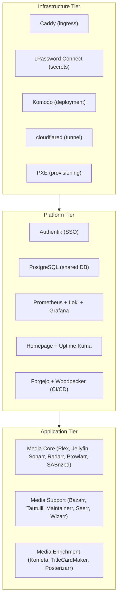
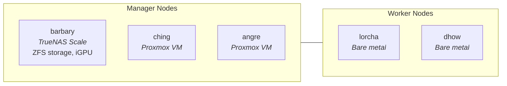
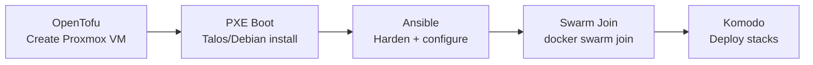

# Architecture Overview

This document describes the homelab infrastructure architecture after the migration from Kubernetes/Talos to Docker Swarm on TrueNAS Scale (see [ADR-0033](../adr/ADR-0033-truenas-swarm-migration.md)).

## Infrastructure Tiers

The homelab follows a three-tier deployment model. Each tier depends on the one below it.

**Infrastructure** must be running before Platform services can start. Platform must be running before Application services deploy. See [deployment-flow.md](deployment-flow.md) for the full bootstrap sequence.

## Node Topology

The Swarm cluster consists of five nodes across three hardware types.

| Node | Role | Platform | Key Responsibilities |
|------|------|----------|---------------------|
| barbary | Manager (leader) | TrueNAS Scale | ZFS storage, iGPU transcoding, stateful services |
| ching | Manager | Proxmox VM | Swarm quorum, floating workloads |
| angre | Manager | Proxmox VM | Swarm quorum, floating workloads |
| lorcha | Worker | Bare metal | Application workloads |
| dhow | Worker | Bare metal | Application workloads |

Stateful services with local storage (SQLite, TSDB, iGPU) are pinned to barbary via placement constraints. Stateless services backed by PostgreSQL or Redis float across all nodes.

## Provisioning Pipeline

New nodes are provisioned through an automated pipeline:

- **OpenTofu** provisions VMs on the Proxmox host (ching, angre)
- **PXE** handles network boot and OS installation for bare-metal nodes (lorcha, dhow)
- **Ansible** runs hardening, NFS mounts, Docker install, and Swarm join
- **Komodo** deploys stacks automatically once the node joins the Swarm

See [ansible/README.md](../../ansible/README.md) and the [runbooks](../runbooks/) for operational procedures.

## Technology Stack

| Component | Technology | Purpose |
|-----------|-----------|---------|
| Orchestration | Docker Swarm | Container scheduling, overlay networking, rolling updates |
| Ingress | Caddy + caddy-docker-proxy | TLS termination, reverse proxy, label-driven routing |
| Tunnel | cloudflared | External access via Cloudflare Tunnel |
| SSO | Authentik | Forward auth, OIDC/SAML provider |
| Secrets | 1Password Connect | Secret injection via `op inject` one-shot jobs |
| Deployment | Komodo + ResourceSync | Git-driven stack deployment, monitoring, alerting |
| Monitoring | Prometheus + Grafana | Metrics collection, dashboards, alerting |
| Logging | Loki + Promtail | Centralized log aggregation |
| Dashboard | Homepage | Service dashboard with label-driven registration |
| Uptime | Uptime Kuma + AutoKuma | Health checks, label-driven monitor creation |
| Git Forge | Forgejo | Self-hosted Git hosting, container registry, OAuth2 provider |
| CI/CD | Woodpecker CI | Pipeline execution via Forgejo webhooks, Docker backend |
| Database | PostgreSQL (shared + dedicated) | Shared: Sonarr, Radarr, Prowlarr, Seerr, Grafana; Dedicated: Authentik, Forgejo |
| Storage | TrueNAS ZFS | Dataset management, snapshots, NFS exports |
| Provisioning | OpenTofu + Ansible | VM creation, node bootstrap, hardening |
| PXE | dnsmasq + matchbox | Network boot for bare-metal nodes |

## Related Documentation

- [Networking](networking.md) — overlay networks, ingress flow, DNS
- [Storage](storage.md) — TrueNAS mounts, backup strategy, UID/GID
- [Secrets](secrets.md) — 1Password Connect, secret injection pattern
- [Deployment Flow](deployment-flow.md) — Komodo ResourceSync, bootstrap sequence
- [Runbooks](../runbooks/) — operational procedures
