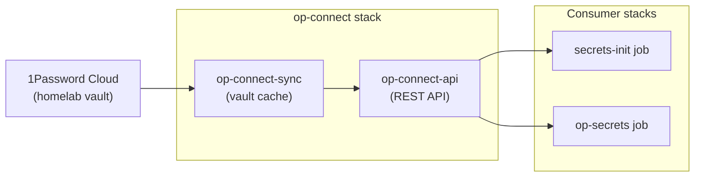
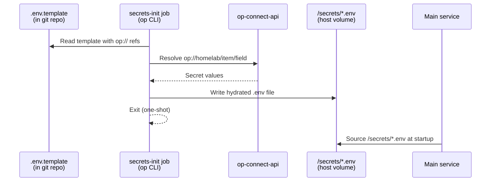

# Secrets Management

## 1Password Connect Architecture

Secrets are managed in 1Password and injected into containers via 1Password Connect, which runs as part of the infrastructure tier.



- **op-connect-api** exposes a REST API on the `op-connect` overlay network
- **op-connect-sync** maintains a local cache of vault data
- Both are pinned to barbary (local volume for credentials and cache)
- The `op-connect` overlay network is external — consumer stacks attach to it

## Secret Injection Pattern

Every stack that needs secrets runs a one-shot init job using `op inject`. This hydrates a template file into a concrete `.env` or config file, which the main service then loads at startup.



**Template example** (`media.env.template`):
```
SONARR__POSTGRES__PASSWORD={{ op://homelab/postgres-shared/password }}
SONARR_API_KEY=op://homelab/sonarr/SONARR_API_KEY
```

**Hydrated output** (`/mnt/apps01/appdata/media/core/secrets/media.env`):
```
SONARR__POSTGRES__PASSWORD=actual-secret-value
SONARR_API_KEY=actual-api-key
```

The init job runs as a Swarm `replicated-job` with `restart_policy: none`. It must complete before the dependent services start (enforced via `depends_on` with `condition: service_completed_successfully`).

See [ADR-0035](../adr/ADR-0035-swarm-oneshot-secret-hydration-jobs.md) for the design rationale.

## Swarm External Secrets

The infrastructure tier (bootstrap level) cannot use 1Password Connect because Connect itself hasn't started yet. These bootstrap secrets are Docker Swarm secrets created manually:

| Swarm Secret | Used By | Source |
|-------------|---------|--------|
| `op_connect_token` | op-connect-api | 1Password service account token |
| `CLOUDFLARE_API_TOKEN` | Caddy, cloudflared | Cloudflare API token |
| `komodo_db_password` | Komodo core + MongoDB | MongoDB password |
| `komodo_passkey` | Komodo core | API passkey |

These are created once during initial bootstrap via `docker secret create` and persist across stack redeploys.

## 1Password Vault Organization

All secrets are stored in the `homelab` vault in 1Password, organized by stack (one item per stack or service). Each item contains the credentials and API keys needed by that stack's `*.env.template`. Refer to 1Password directly for the current inventory of items and fields.

## Template File Convention

Secret templates follow the naming pattern `*.env.template` and live alongside the compose file in each stack directory:

```
stacks/application/media/core/
├── compose.yaml
└── media.env.template          # op:// references

stacks/application/media/support/
├── compose.yaml
└── support.env.template        # op:// references

stacks/platform/monitoring/
├── compose.yaml
└── grafana.env.template        # op:// references

stacks/platform/cicd/forgejo/
├── compose.yaml
└── env.template                # op:// references (DB + Forgejo internals)

stacks/platform/cicd/woodpecker/
├── compose.yaml
└── env.template                # op:// references (Forgejo OAuth, agent secret)

stacks/platform/auth/authentik/
├── compose.yaml
├── env.template                # op:// references (Authentik core)
├── postgres.template           # op:// references (Authentik DB)
└── blueprints/
    ├── oauth2-forgejo.yaml.template  # op:// refs in YAML blueprint (op inject → /blueprints/custom/generated/)
    └── homepage-token.yaml.template  # op:// refs in YAML blueprint
```

Note: Authentik uses two kinds of templates — standard `.env.template` files for environment variables, and `.yaml.template` files for blueprints that contain `op://` references within YAML config. Both are processed by `op inject` during the secrets-init job.

Templates are checked into git (they contain only reference URIs, not actual secrets). The hydrated `.env` files are written to host volumes under `/mnt/apps01/appdata/*/secrets/` and are never committed.

## Related Documentation

- [Overview](overview.md) — infrastructure tiers
- [Storage](storage.md) — where hydrated secrets are stored on disk
- [Deployment Flow](deployment-flow.md) — how init jobs fit into the deploy sequence
